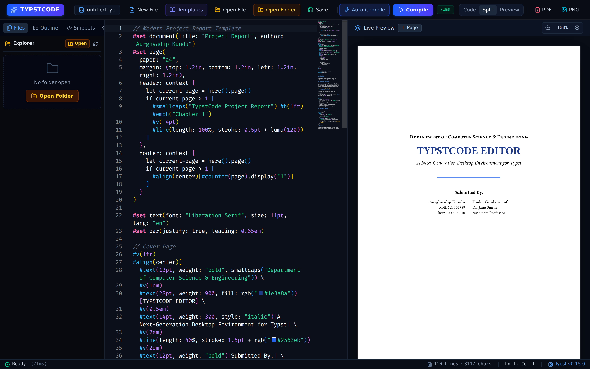
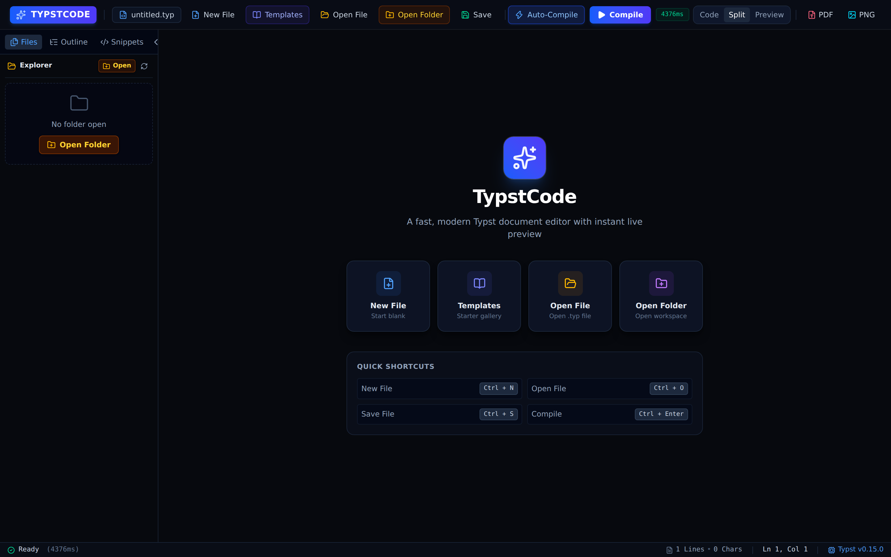
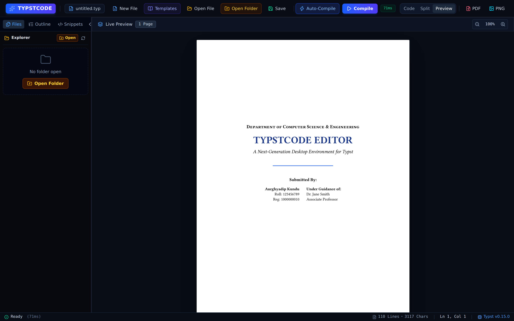

# ⚡ TypstCode - Modern Typst Desktop Editor

**TypstCode** is a modern, high-performance desktop editor for [Typst](https://typst.app/) built with **Electron**, **React**, **Vite**, and **Monaco Editor**.


---

## 📸 Screenshots

| Editor & Live Preview | Welcome Screen |
| :---: | :---: |
|  |  |

| Starter Template Gallery | Full Live Preview |
| :---: | :---: |
|  |  |

---

## ✨ Features

- **VS Code-Grade Monaco Editor**: Built-in syntax highlighting for Typst (`typst-dark` theme), line numbers, minimap, auto-closing brackets, and custom snippets.
- **Sub-Millisecond Live Preview**: Instant live rendering of Typst documents into high-resolution SVG pages directly within Electron.
- **File Explorer Sidebar**: Integrated file browser tree to easily navigate, open, and edit workspace files.
- **Interactive Error Diagnostics**: Real-time parsing of Typst compilation diagnostics; clicking any error jumps the editor cursor straight to the exact line & column.
- **Document Outline Navigation**: Automatically extracts headings (`= Section`, `== Subsection`) to navigate long documents effortlessly.
- **Snippet Palette & Cheat Sheet**: One-click insertion for equations, matrices, integrals, tables, callout boxes, and multi-column grid layouts.
- **Starter Template Gallery**: Pre-built templates for Modern Project Reports, IEEE Academic Research Papers, Executive Resumes, and Mathematics Cheat Sheets.
- **Multi-Format Export**: One-click PDF & PNG export powered by the local `typst` CLI binary.

---

## 🚀 Quick Start

### 1. Prerequisites
Ensure you have Node.js (v18+) and the `typst` binary installed on your system:
```bash
typst --version
```

### 2. Development Mode
Start Vite dev server and launch Electron simultaneously:
```bash
npm run dev
```

### 3. Packaging for Distribution

Build web assets and generate installer packages for your platform:

```bash
# Build for all platforms (Windows, macOS, Linux)
npm run dist:all

# Build Windows NSIS Installer (.exe)
npm run dist:win

# Build macOS DMG & ZIP (.dmg, .zip)
npm run dist:mac

# Build Linux AppImage, DEB, & RPM (.AppImage, .deb, .rpm)
npm run dist:linux
```

### 4. Automated CI/CD Releases

Push a version tag to trigger the GitHub Actions workflow (`.github/workflows/release.yml`) to automatically build installers for Windows (`.exe`), macOS (`.dmg`, `.zip`), and Linux (`.AppImage`, `.deb`, `.rpm`) and upload them to a GitHub Release:

```bash
git tag v1.0.0
git push origin v1.0.0
```

---

## 🛠️ Tech Stack

- **Desktop Container**: Electron
- **Bundler & Build Tool**: Vite + `vite-plugin-electron`
- **Frontend UI**: React 19 + TailwindCSS
- **Code Editor**: `@monaco-editor/react` (Monaco Editor engine)
- **Compiler**: Local `typst` binary (via Node `child_process.spawn`)
- **Icons**: `lucide-react`

## Todo
- [ ] Sign release.
- [ ] Optimize the release to keep package size small.
